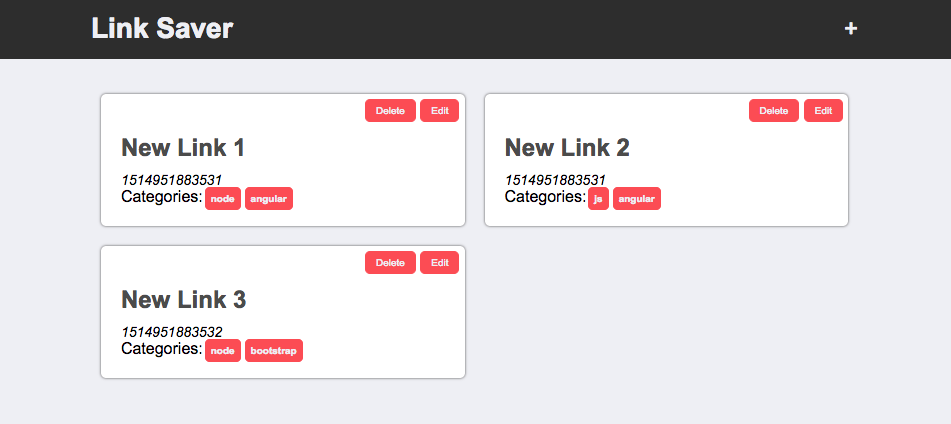

## 11. Responsive Design With Flexbox

[Go to the video]()

In this video, we will update our application to make it more responsive and mobile friendly because we want our application to look great on all types of devices. We will get introduced to media queries which allow us to define specific styles that are only applied when the width of the screen is within a certain range.  We will additionally use Flexbox to create a basic grid system for our display of links and update our header to stack the title and add button vertically when on smaller screens.

### References

- [Responsive Web Design Media Queries](https://www.w3schools.com/css/css_rwd_mediaqueries.asp)

- [Dont Overthink Flexbox Grid](https://css-tricks.com/dont-overthink-flexbox-grids/)

- [A Guide To Flexbox](https://css-tricks.com/snippets/css/a-guide-to-flexbox/)

- [What the Flebox by Wes Bos](https://flexbox.io/)

- [Flexbox Froggy (Game for learning Flexbox)](http://flexboxfroggy.com/)

- [A visual Guide to CSS3 Flexbox Properties](https://scotch.io/tutorials/a-visual-guide-to-css3-flexbox-properties )
