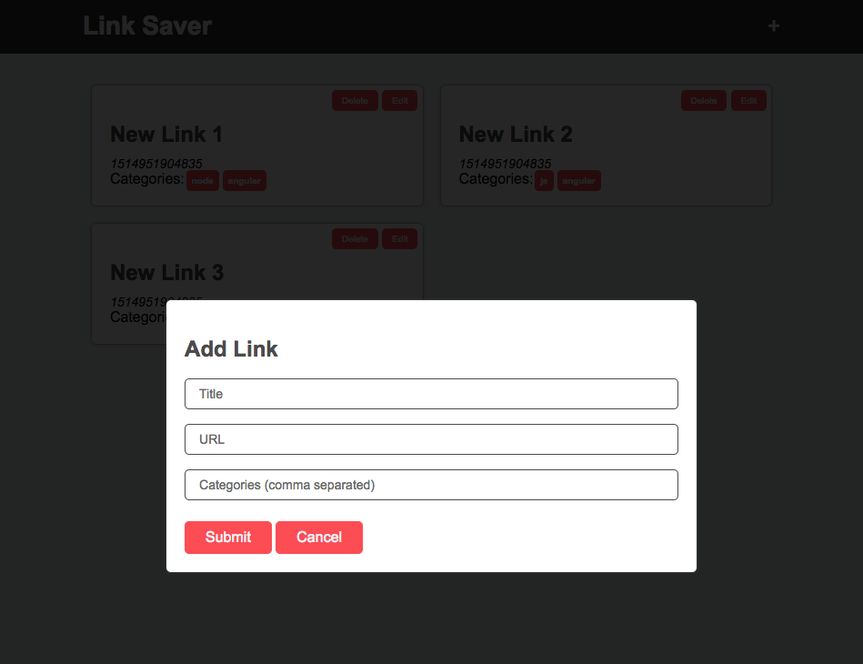

## 14. Animations

[Go to the video]()

In this video, we will get introduced to CSS Animations.  We will create simple animations like slide right and shake before creating the slide down transition that will be used for our add link form.  We will discuss how animations can be used to provide useful feedback and context to the user.

### References

- [CSS Animations Series by DevTips](https://www.youtube.com/watch?v=8kK-cA99SA0&list=PLqGj3iMvMa4LvJ8VctoXnPI0dtE40wfid)

- [CSS Animation and Transitions Crash Course by Travery Media](https://www.youtube.com/watch?v=zHUpx90NerM)
