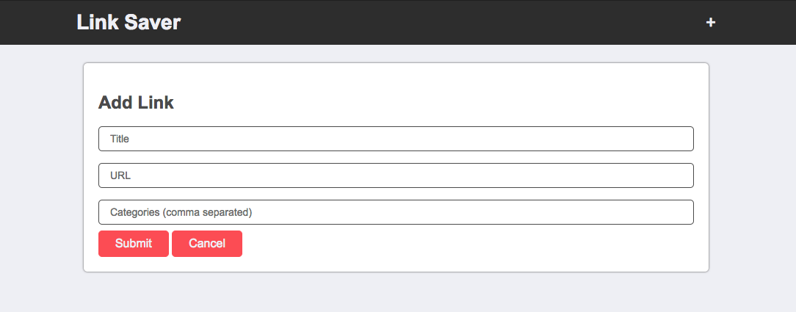

## 5. Working with DOM Elements, Event Listeners, ES6 CONST and LET

[Go to the video]()

In this video, we will add the functionality to accept comma separated input from the user for a list of categories.  When a user types a comma into the categories input, we will save that category and clear out the input for him/her to keep typing and add more.  To do this, we will need to reference DOM elements in our Javascript.  As we do, we will discuss the difference between VAR keyword and the newer CONST and LET keywords.

### References

- [Javasctipt DOM Elements](https://www.w3schools.com/js/js_htmldom_elements.asp)

- [Keydown Event Handler](https://www.w3schools.com/jsref/event_onkeydown.asp)

- [Key Code Info](http://keycode.info/)

- [Let vs Const by Wes Bos](http://wesbos.com/let-vs-const/)
