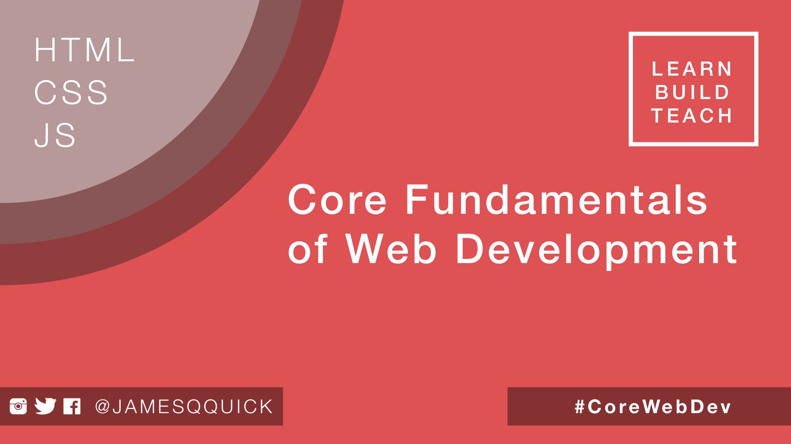

# Core-Fundamentals-of-Web-Development

> ### Find me on twitter at [@jamesqquick](https://twitter.com/jamesqquick) and use the hashtag #CoreWebDev

## Intro

Welcome to Core Fundamentals of Web Development!  In this course, we will use pure HTML, CSS, and Javascript (no libraries or frameworks!!) to create a Link Saver application.  The hope is that by foregoing all of the libraries and frameworks out there, we will increase our core knowledge and understanding of how different aspects of web development will work.  This course is designed for Beginner to Intermediate Web Developers who are looking to learn new concepts or reinforce ones they've already been exposed to.  The content is initially scheduled for 15 videos, but I am hoping to follow up with some bonus material based on your feedback!  If you would like to see any additional topics covered, let me know on twitter, @jamesqquick

## People I Follow/ Additional Resources
- Brad Traversy/ Traversy Media - free content on [YouTube](https://www.youtube.com/channel/UC29ju8bIPH5as8OGnQzwJyA) and paid classes on [Udemy](https://www.udemy.com/user/brad-traversy/)
- Colt Steele - [Web Developer Bootcamp]() and [Advanced Web Developer Bootcamp](https://www.udemy.com/the-advanced-web-developer-bootcamp/) on Udemy
- WesBos - free and paid courses on [Web Development](http://wesbos.com/courses/)

## Topics We Will Cover

- CSS Variables and Resets
- CSS Flexbox
- Core Javascript (working with and manipulating DOM elements, creating event listeners,  and creating and handling form submissions)
- New features of Javascript as of ES6 (arrow functions, const and let, 'let of' loop, template literals)
-  Media Queries and Responsive Design
- CSS Transitions and Animations

## Format
In this course, we will progressively build a web application.  With each new video, we will introduce a new topic, talk about its use and functionality, and then include it in our application.  Several of the topics we discuss will be touched on but not covered in depth.  You will need to explore deeper topics such as Flexbox, the 'This' keyword, and Arrow Functions on your own to truly master them.  For most sections, there are several reference links for more guidance.

## 1. Getting Familiar With the Tools (Visual Studio Code, Google Chrome, and Chrome Developer Tools)

[Go to the video](https://youtu.be/i5ajsKSnBHc)

[Go to the Source Code](./Part-1)

In this video, we will talk about the tools we will be using in this course.  I want to make sure that everyone is on the same page as we progress throughout the course.  We will talk about various shortcuts and extensions in Visual Studio Code as well as a brief introduction to the Chrome Developer Tools to inspect elements and their styles as well as the console to inspect output from out Javascript.  It is highly recommended that you attempt to follow along and use the shortcuts that are available as they will help speed up your development process in the future!

### References

- [Download Google Chrome](https://www.google.com/chrome/browser/desktop/index.html)

- [Visual Studio Code](https://code.visualstudio.com/)

- [Chrome Developer Tools](https://developer.chrome.com/devtools)

- [Visual Studio Code Key Bindings](https://code.visualstudio.com/docs/getstarted/keybindings)

- [Visual Studio Code Marketplace for Extensions/Plugins](https://marketplace.visualstudio.com/)

- [Emmet Shortcuts](https://docs.emmet.io/)

## 2. Creating The App Skeleton

[Go to the video](https://youtu.be/JNZL1whsSvo)

[Go to the Source Code](./Part-2)

In this video, we will stub out the basic structure of our application.  We will create placeholders in our HTML for our Navbar, our Add Link Form, and our Links List display.  We will also perform some setup in CSS by creating CSS Variables for our application colors, defining basic resets to standardize rendering across browsers, and organizing our CSS file into sections.

### References

- [MDN CSS Variables Docs](https://developer.mozilla.org/en-US/docs/Web/CSS/Using_CSS_variables)

- [What is a CSS Reset](https://cssreset.com/what-is-a-css-reset/)
	

## 3. Introduction to Flexbox and Building the Navbar

[Go to the video](https://youtu.be/rg3ufS4l9d0)

[Go to the Source Code](./Part-3)

In this video, we will get introduced to Flexbox, which provides a more efficient way to lay out, align, and distribute space among items in a container.  With Flexbox, we can address problems easily that, in the past, were hard to solve such as vertically centering content inside of a parent, providing equal space to children of a container, and ensuring a consistent height across multiple columns of varied content.  We will specifically leverage Flexbox to build a simple navigation navigation bar that contains a title and an add button.

### References
- [Flexbox MDN Docs](https://developer.mozilla.org/en-US/docs/Learn/CSS/CSS_layout/Flexbox)

- [A Guide To Flexbox](https://css-tricks.com/snippets/css/a-guide-to-flexbox/)

- [What the Flebox by Wes Bos](https://flexbox.io/)
- [Flexbox Froggy (Game for learning Flexbox)](http://flexboxfroggy.com/)

- [A visual Guide to CSS3 Flexbox Properties](https://scotch.io/tutorials/a-visual-guide-to-css3-flexbox-properties)

## 4. Creating and Styling Forms

[Go to the video](https://youtu.be/CLJ_hSqmuwY)

[Go to the Source Code](./Part-4)

In this video, we are going to create the form that users will leverage to add new links.  This form will have three inputs: title, url, and a list of categories (all comma separated). We will also include two buttons, one to submit the form, and one to cancel and close the form itself.

### References

- [Styling Forms](https://www.w3schools.com/css/css_form.asp)

- [Advanced Styling for HTML Forms MDN Docs](https://developer.mozilla.org/en-US/docs/Learn/HTML/Forms/Advanced_styling_for_HTML_forms)

## 5. Working with DOM Elements, Event Listeners, ES6 CONST and LET

[Go to the video](https://youtu.be/oe6JEQHUDfY)

[Go to the Source Code](./Part-5)

In this video, we will add the functionality to accept comma separated input from the user for a list of categories.  When a user types a comma into the categories input, we will save that category and clear out the input for him/her to keep typing and add more.  To do this, we will need to reference DOM elements in our Javascript.  As we do, we will discuss the difference between VAR keyword and the newer CONST and LET keywords.

### References

- [Javasctipt DOM Elements](https://www.w3schools.com/js/js_htmldom_elements.asp)

- [Keydown Event Handler](https://www.w3schools.com/jsref/event_onkeydown.asp)

- [Key Code Info](http://keycode.info/)

- [Let vs Const by Wes Bos](http://wesbos.com/let-vs-const/)

## 6. Arrow Functions and the This Keyword

[Go to the video](https://youtu.be/-067nE6O2go)

[Go to the Source Code](./Part-6)

In this video, we will add functionality to the add button of our form.  When the user submits the form, we will extract the form input, create a new "Link" object from that input, and add it to an array.  As we do this, we will update our callback function syntax from using traditional callbacks to use ES6 Arrow Functions and discuss its impact on the This keyword.

### References
- [Understanding the This Keyword in Javascript](https://toddmotto.com/understanding-the-this-keyword-in-javascript)
- [ES6 Arrow Function New Fat Concise Syntax Javascript](https://www.sitepoint.com/es6-arrow-functions-new-fat-concise-syntax-javascript/)

## 7. Adding and Removing Classes in Javascript

[Go to the video](https://youtu.be/_gwDrQRP5bs)

[Go to the Source Code](./Part-7)

In this videos, we will add the functionality to show and hide the add link form.  We will accomplish this by adding/removing the 'hidden' class to/from the form.  This video will help to reinfornce topics from the previous two videos: working with DOM elements, event listeners, defining variables with ES6 Let and Const, and ES6 Arrow Functions.  Additionally, we will learn how to add and remove classes from a DOM element in Javascript.

### References

- [Add Remove Classes With Raw Javascript](https://jaketrent.com/post/addremove-classes-raw-javascript/)

- [Javasctipt DOM Elements](https://www.w3schools.com/js/js_htmldom_elements.asp)

- [Keydown Event Handler](https://www.w3schools.com/jsref/event_onkeydown.asp)

- [Key Code Info](http://keycode.info/)

- [Let vs Const by Wes Bos](http://wesbos.com/let-vs-const/)

- [Understanding the This Keyword in Javascript](https://toddmotto.com/understanding-the-this-keyword-in-javascript/)

- [ES6 Arrow Function](https://www.sitepoint.com/es6-arrow-functions-new-fat-concise-syntax-javascript/)

## 8. Displaying Static Link

[Go to the video](https://youtu.be/Rm6VbE62hHY)

[Go to the Source Code](./Part-8)

In this video, we will take a break from Javascript and come back to our HTML and CSS to display a static link.  In the following video, we will take this code as the template to generate dynamic HTML strings for each of the added links.

## 9. Generating Dynamic HTML with Es6 Template Literals 

[Go to the video](https://youtu.be/QGAVFfLGgbo)

[Go to the Source Code](./Part-9)

In this video, we will use the ES6 'For Of' loop to iterate through the array of added links.  For each of the link objects, we will use the HTML template from the previous video to dynamically generate the appropriate HTML string for each of the users added links.  To help use generate the HTML strings, we will take advantage of ES6 Template Literals.

### References
- [Template Literals MDN Docs](https://developer.mozilla.org/en-US/docs/Web/JavaScript/Reference/Template_literals)

- [ES6 For Of MDN Docs](https://developer.mozilla.org/en-US/docs/Web/JavaScript/Reference/Statements/for...of)

## 10. Adding Edit and Delete Functionality

[Go to the video](https://youtu.be/PIqttphHhHk)

[Go to the Source Code](./Part-10)

In this video, we will add the ability to edit and delete links.  We will save code by reusing the same add link form and event listener, both when a user is adding a new link and editing an old link.  This video will serve as a reinforcement of previous videos in working with DOM elements, event listeners, arrow functions, etc.

## 11. Responsive Design With Flexbox

[Go to the video](https://youtu.be/Vy7BIzS-340)

[Go to the Source Code](./Part-11)

In this video, we will update our application to make it more responsive and mobile friendly because we want our application to look great on all types of devices. We will get introduced to media queries which allow us to define specific styles that are only applied when the width of the screen is within a certain range.  We will additionally use Flexbox to create a basic grid system for our display of links and update our header to stack the title and add button vertically when on smaller screens.

### References

- [Responsive Web Design Media Queries](https://www.w3schools.com/css/css_rwd_mediaqueries.asp)

- [Dont Overthink Flexbox Grid](https://css-tricks.com/dont-overthink-flexbox-grids/)

- [A Guide To Flexbox](https://css-tricks.com/snippets/css/a-guide-to-flexbox/)

- [What the Flebox by Wes Bos](https://flexbox.io/)

- [Flexbox Froggy (Game for learning Flexbox)](http://flexboxfroggy.com/)

- [A visual Guide to CSS3 Flexbox Properties](https://scotch.io/tutorials/a-visual-guide-to-css3-flexbox-properties )

## 12. Applying Transitions

[Go to the video](https://youtu.be/aBd5mCdbumI)

[Go to the Source Code](./Part-12)

In this video, we will get introduced to CSS Transitions and apply them to several elements in our applications.  We will discuss the shorthand syntax for defining transitions as well as touch on the most performant properties to transition on (translate, rotate, scale, and opacity);

### References

- [Transition](https://css-tricks.com/almanac/properties/t/transition/)

- [CSS Transition by DevTips](https://www.youtube.com/watch?v=8kK-cA99SA0&t=871s)

- [CSS Animation and Transitions Crash Course by Travery Media](https://www.youtube.com/watch?v=zHUpx90NerM)

## 13. Full Screen Popups

[Go to the video](https://youtu.be/y4h6Ne-jgBc)

[Go to the Source Code](./Part-13)

In this video, we will create a full screen popup for our add link form.  This way it does not push down our links list content when the user wants to add a link.  This full screen popup can be used in many ways (logins/register forms, loading icons, etc.).  It will take up the entire width and height of the window with a semi transparent dark background.  This lets the user know that they are unable to interact with anything in the background until loading has finished, they complete a form, etc.

## 14. Animations

[Go to the video](https://youtu.be/RAicn0li6wA)

[Go to the Source Code](./Part-14)

In this video, we will get introduced to CSS Animations.  We will create simple animations like slide right and shake before creating the slide down transition that will be used for our add link form.  We will discuss how animations can be used to provide useful feedback and context to the user.

### References

- [CSS Animations Series by DevTips](https://www.youtube.com/watch?v=8kK-cA99SA0&list=PLqGj3iMvMa4LvJ8VctoXnPI0dtE40wfid)

- [CSS Animation and Transitions Crash Course by Travery Media](https://www.youtube.com/watch?v=zHUpx90NerM)

## 15. Cleanup

[Go to the video]()

[Go to the Source Code](./Part-15)

In this video, we will clean up our application a bit by correctly displaying the date a link was created, removing unnecessary HTML, and adding a hover effect to our links.  

### References

- [Javascript Dates](https://www.w3schools.com/js/js_dates.asp)
- [Two Digit Month and Date in Javascript Date](https://stackoverflow.com/questions/6040515/how-do-i-get-month-and-date-of-javascript-in-2-digit-format)
- [String Slice](https://developer.mozilla.org/en-US/docs/Web/JavaScript/Reference/Global_Objects/String/slice)

# Course Wrap Up

[Go to the video]()

In this video, we will reflect on everything that we've covered, which is a lot!  We've taken at least an intermediate dive in HTML, CSS, and Javascript.  We've focused on the core aspects of Web Development, skills that will take you far.  No matter what framework or library you use in the future, you now have a better understanding of how they work and what they are taking care of for you.

## Bonus Topics??
If you enjoyed the content, have suggestions/critiques, or would like to see some bonus topics covered, let me know on twitter at @jamesQquick!

